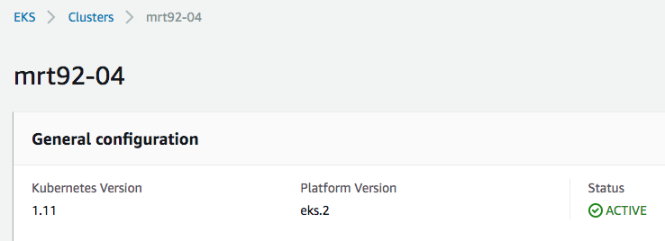

# Multiple Worker Groups

## Working Concept:
When providing multiple workgroups manually in the locals.tf file and the needed variable values in a variable file, the terraform EKS module will build out the desired infrastructure.

## Problem
Each worker group needs a set of specific settings and a set of mandatory defaults.  Currently the version of Terraform (v0.11.13) does not allow programatical iteration over a variable amount of lists or maps of settings to merge the mandatory defaults with the user specified information.  Because of this restriction we also also not be able to verify if all needed information to build nodes is available, possibly resulting in failures.
Performing this step in Python or Bash would be an option but that sideswipes the project mandate of using Terraform for building out the infrastructure.

## Solution
Untill Terraform will provide a better way to merge a dynamic number of lists/maps, this project will be put in the backlog.  All necessary documentation of progress made in the POC will be provided in this branch.

## Documentation

### Setup
Provide the needed structure in local.tf to build multiple worker-groups.  This example will spin up two worker-groups each with their own settings:

```
locals {
  worker_groups = [
    {
      name                  = "worker_group_sysops"
      kubelet_extra_args    = "--node-labels=worker_group=sysops"
      asg_min_size          = "${var.worker_node_sysops_min}"
      asg_max_size          = "${var.worker_node_sysops_max}"
      asg_desired_capacity  = "${var.worker_node_sysops_desired}"
      instance_type         = "${var.worker_node_sysops_instance}"
      key_name              = "${var.key_name_ops}"
      pre_userdata          = "${data.template_file.http_proxy_workergroup.rendered}" 
      autoscaling_enabled   = "${var.enable_cluster_autoscaling}"
      protect_from_scale_in = "${var.protect_cluster_from_scale_in}"
      subnets               = "${join(",", var.private_subnets)}" 
    },
    {
      name                  = "worker_group_app"
      kubelet_extra_args    = "--node-labels=worker_group=app"
      asg_min_size          = "${var.worker_node_app_min}"
      asg_max_size          = "${var.worker_node_app_max}"
      asg_desired_capacity  = "${var.worker_node_app_desired}"
      instance_type         = "${var.worker_node_app_instance}"
      key_name              = "${var.key_name_app}"
      pre_userdata          = "${data.template_file.http_proxy_workergroup.rendered}"
      autoscaling_enabled   = "${var.enable_cluster_autoscaling}"
      protect_from_scale_in = "${var.protect_cluster_from_scale_in}"
      subnets               = "${join(",", var.private_subnets)}"
    },
  ]
}
```


#### User defined variables for worker group:
 * `name` - should be unique and will be used in resource names and tags.
 * `kubelet_extra_args` - is a unique tag added to the nodes and will be used for `nodeaffinity` to target deployments
 * `asg_min_size` - autoscaling group setting: minimum amount of nodes running at any time in asg
 * `asg_max_size` - autoscaling group setting: maximum amount of nodes allowed in asg
 * `asg_desired_capacity` - autoscaling group setting: desired amount of nodes running in asg: this is the variable that is used by vertical autoscaling to run the amount of nodes to accommodate the current workload
 * `instance_type` - which type of AWS EC2 instance will be used to build the worker group (keeping in mind that the larger the instance, the more IP addresses will be reserved)
 * `key_name` - ssh-key-pair to use to access the individual nodes.  The option is offered to set different key-pairs for the wg's.

#### Mandatory variables to build worker group:
 * `pre_userdata` - information passed to the worker group nodes to allow nodes to function within the restricted VPC (proxy) setup.
 * `autoscaling_enabled`
 * `protect_from_scale_in` - should be set to `no`
 * `subnets` - 
   
### Result:
When the above variables are provided (e.g. with a terraform.tfvars or terraform.auto.tfvars file), the EKS cluster with two worker groups is created:

#### EKS Cluster:


#### Nodes in EKS cluster:
```
kubectl get nodes --show-labels
NAME                         STATUS   ROLES    AGE   VERSION   LABELS
ip-<redacted>.ec2.internal   Ready    <none>   7h    v1.11.9   <redacted>,worker_group=sysops
ip-<redacted>.ec2.internal   Ready    <none>   7h    v1.11.9   <redacted>,worker_group=app
```

Here we see that the nodes have additional labels (provided in the `kubelet_extra_args`).  This label will be used to set the node affinity within a deployment.

#### Node Affinity
The following code snippet will introduce node affinity within a kube deployment to run only on nodes with the label `worker_group=sysops`.   

```
spec:
    affinity:
    nodeAffinity:
        requiredDuringSchedulingIgnoredDuringExecution:
        nodeSelectorTerms:
        - matchExpressions:
            - key: worker_group
            operator: In
            values:
            - sysops
```   

#### Pod Affinity
The following code snippet will introduce node affinity to nodes with the label `worker_group=sysops` when running a single pod:
  
```
spec:
  affinity:
    nodeAffinity:
      preferredDuringSchedulingIgnoredDuringExecution:
      - weight: 1
        preference:
          matchExpressions:
          - key: worker_group
            operator: In
            values:
            - sysops
```


#### End result with node-affinity implemented within the various deployment:
```
pods on sysops group: 

kube-system   aws-node-96xl8                                1/1   Running   0     7h
kube-system   coredns-78454467f7-zcjnr                      1/1   Running   0     7h
kube-system   kube-proxy-g98m9                              1/1   Running   0     7h
kube-system   tiller-deploy-677f9d9db8-zx8hs                1/1   Running   0     7h
kube-system   vertical-cluster-autoscaler-8d7b8cfc7-zx8zc   1/1   Running   0     7h
metrics       metrics-server-96d964d7b-z7pb6                1/1   Running   0     7h


pods on app group: 

kube-system   aws-node-57c5q             1/1   Running   0     7h
kube-system   coredns-78454467f7-76rrf   1/1   Running   0     7h
kube-system   kube-proxy-j5rwh           1/1   Running   0     7h
```

In the above, you can see that the tiller,metrics and cluster-autoscaler are running on the sysops worker_group.  


## Notes
* The system applications `aws-node`, `coredns` and `kube-proxy` need to run on each node in the cluster to maintain cluster functionality and therefor should not be modified to include node affinity.

* If a node-affinity value is entered in the deployment that does not match the actual label on any of the nodes, the deployment will not roll out as the kube scheduler is not able to find a qualifing node.

